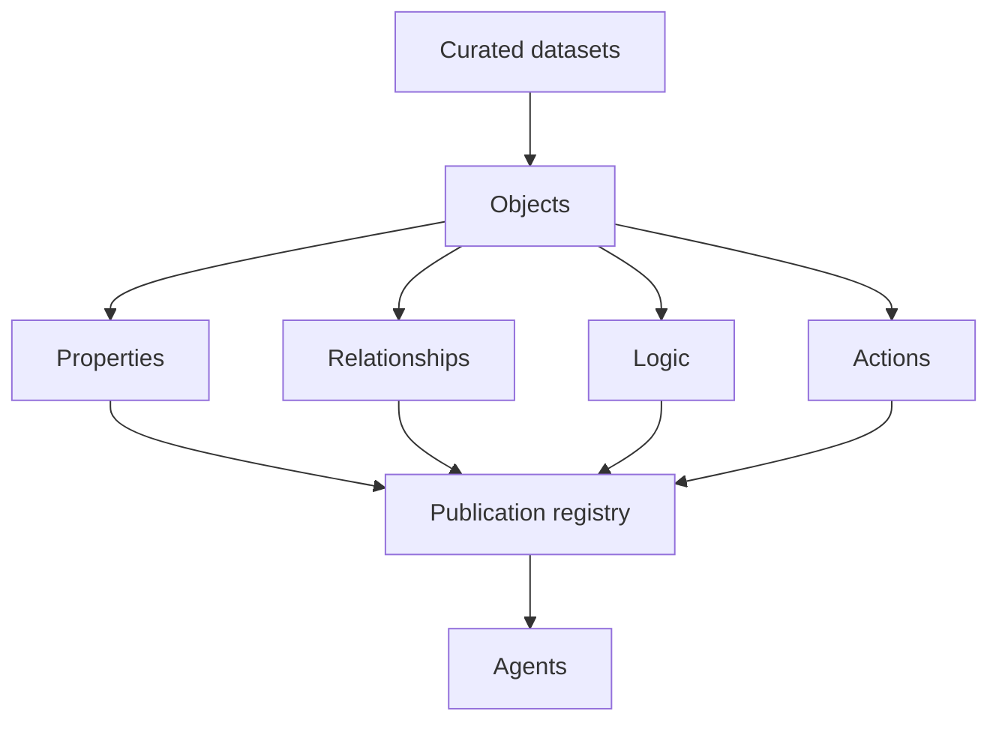
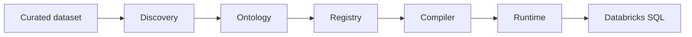

<div align="center">
  <picture>
    <source media="(prefers-color-scheme: dark)" srcset="docs/assets/logo-white.png" />
    <source media="(prefers-color-scheme: light)" srcset="docs/assets/logo-black.png" />
    
  </picture>
  <p>
    <strong>The governed ontology for your organization</strong><br />
    Objects, relationships, logic, and actions — evidence-backed, reviewed, and versioned
  </p>
  <p>
    
    
    
    
  </p>
</div>

Organizations hold curated datasets in their warehouse. They rarely hold a single, auditable definition of what that data **means**. Anchor produces that definition: a **governed ontology** above your datasets, without replacing the systems that store the rows.

**Anchor does not turn raw data into datasets. Anchor turns datasets into meaning.** Ingestion, parsing, and storage belong to your data platform; Anchor starts where a structured, queryable dataset already exists.

Stewards review what inference cannot confirm. Agents consume what the organization has published.

---

## Ontology

| Primitive        | Meaning                                                      |
| ---------------- | ------------------------------------------------------------ |
| **Object**       | A business concept tied to a dataset                         |
| **Property**     | An attribute tied to a column                                |
| **Relationship** | A link between objects, with cardinality                     |
| **Logic**        | A business definition or constraint                          |
| **Action**       | An operation contract on an object (specified; not executed) |

Each element records **confidence**, **provenance**, **review status**, and a **lifecycle** from discovery to publication.



Datasets become objects. Properties, relationships, logic, and actions describe those objects. The publication registry stores that version. Agents read the registry and query objects through it.

Full specification: **[Ontology](./docs/ONTOLOGY.md)**.

---

## Operating model

The flow before Anchor stays in your platform: **files / databases / APIs → ingestion → warehouse pipeline → curated dataset**. Anchor begins at the curated dataset.

| Step          | Question                   | What happens                                                                  |
| ------------- | -------------------------- | ----------------------------------------------------------------------------- |
| **Connect**   | Where is the data?         | A Databricks SQL warehouse, queried in place                                  |
| **Evidence**  | What does the schema show? | Dataset profiles and a proposed set of objects, properties, and relationships |
| **Agreement** | What do we accept?         | A steward reviews risk-ranked questions. Publish stores a numbered version    |
| **Agents**    | What can an agent rely on? | Deterministic tools and object queries against the published version          |



Discovery is deterministic: schema and statistics only, no language model. Rows never leave your warehouse; object queries run on it directly.

---

## Documentation

| Document                                                        | Audience                                 |
| --------------------------------------------------------------- | ---------------------------------------- |
| **[Ontology](./docs/ONTOLOGY.md)**                              | Structure, primitives, governance fields |
| [Documentation hub](./docs/README.md)                           | Index                                    |
| [Architecture](./docs/ARCHITECTURE.md)                          | System design                            |
| [Operations](./docs/OPERATIONS.md)                              | Workspace and CLI                        |
| [Governance](./docs/GOVERNANCE.md)                              | Review, publish, rollback, audit         |
| [Providers](./docs/PROVIDERS.md)                                | Databricks                               |
| [Repository structure](./docs/STRUCTURE.md)                     | Monorepo map                             |
| [Security and data residency](./docs/SECURITY-AND-RESIDENCY.md) | Security review                          |

---

## Capabilities

| Capability  | Outcome                                                            |
| ----------- | ------------------------------------------------------------------ |
| Workspace   | Local artifacts and a committable ontology                         |
| Discovery   | Deterministic objects and relationships from schema evidence       |
| Review      | Risk-ranked confirmation before anything is treated as agreed      |
| Publication | Numbered versions, archive, and rollback                           |
| Query       | Compiled, parameterized SQL over published objects                 |
| Agents      | MCP over the agreed ontology, with no model call on the query path |

---

## Quick start

**Requirements:** Node.js ≥ 22 · pnpm · a Databricks SQL warehouse

```bash
git clone https://github.com/trybacked/anchor.git
cd anchor && pnpm install && pnpm build
cd apps/cli && pnpm link --global
```

```bash
backed init
backed discover
backed review
backed validate
backed publish
backed serve
```

Environment: copy [`.env.example`](./.env.example) and set `BACKED_DATABRICKS_HOST`, `BACKED_DATABRICKS_TOKEN`, `BACKED_DATABRICKS_WAREHOUSE_ID`. Procedures: [Operations](./docs/OPERATIONS.md).

---

## Command reference

| Command           | Phase   | Result                                                       |
| ----------------- | ------- | ------------------------------------------------------------ |
| `backed init`     | Setup   | Workspace configuration                                      |
| `backed inspect`  | Connect | Dataset catalog from the SQL warehouse                       |
| `backed discover` | Connect | Deterministic discovery report and review proposal           |
| `backed review`   | Govern  | Steward decisions applied to the ontology                    |
| `backed validate` | Govern  | Structural validation                                        |
| `backed publish`  | Govern  | Version recorded in the registry (`--status` lists versions) |
| `backed rollback` | Govern  | A prior published version restored                           |
| `backed diff`     | Change  | Drift between runs (`--ontology` for breaking vs additive)   |
| `backed serve`    | Consume | MCP server                                                   |

---

## Agent interface

`backed serve` answers from the agreed ontology. Responses are structured and schema-validated. There is no language model on this path.

| Operation        | Returns                                                       |
| ---------------- | ------------------------------------------------------------- |
| `list_entities`  | Object catalog                                                |
| `get_entity`     | Properties and provenance                                     |
| `list_relations` | Relationships and cardinality                                 |
| `search_model`   | Search across objects, properties, relationships, and logic   |
| `get_definition` | A confirmed logic statement, or a structured miss             |
| `query_objects`  | Rows of one published object, with property filters and limit |

`query_objects` is available when an ontology is published and the Databricks environment is configured. The query compiles to parameterized SQL from the published mappings and runs on your warehouse.

Tool names follow the current MCP contract. They resolve the ontology primitives in [Ontology](./docs/ONTOLOGY.md).

---

## Data residency

| Data               | Leaves your infrastructure                               |
| ------------------ | -------------------------------------------------------- |
| Rows               | No — object queries run inside your Databricks workspace |
| Agreed ontology    | No, unless you publish it yourself (for example via Git) |
| Warehouse metadata | Only to your Databricks workspace                        |

---

## Development

```bash
pnpm install && pnpm build
pnpm generate:schema
pnpm test
```

```text
anchor/
├── apps/
│   └── cli/                    # backed command line
├── packages/
│   ├── core/                   # ontology schema, validation, DatasetProvider
│   ├── discovery/              # inspect/ evidence · propose/ deterministic proposal
│   ├── registry/               # publications, versioning, rollback
│   ├── compiler/               # object query → parameterized SQL
│   ├── runtime/                # executes compiled queries
│   ├── provider-databricks/    # Databricks SQL warehouse adapter
│   ├── diff/                   # run and ontology diffs
│   └── mcp/                    # agent tools + query_objects
├── schema/                     # JSON Schema for ontology serialization v1
└── docs/
```

| Package                       | Responsibility                                     |
| ----------------------------- | -------------------------------------------------- |
| `@trybacked/core`             | Ontology schema, validation, `DatasetProvider`     |
| `@backed/discovery`           | Deterministic inspection and proposal              |
| `@backed/registry`            | Publications, versioning, rollback                 |
| `@backed/compiler`            | Object queries → parameterized SQL                 |
| `@backed/runtime`             | Executes compiled queries via an injected executor |
| `@backed/provider-databricks` | Databricks SQL warehouse adapter                   |
| `@backed/diff`                | Run and ontology diffs                             |
| `@backed/mcp`                 | Agent tools over the published ontology            |
| `@backed/cli`                 | Command line                                       |

Dependencies flow toward `core`, never the reverse. Full map: [Repository structure](./docs/STRUCTURE.md).

Published packages use `@trybacked/*`. Workspace packages use `@backed/*`.
