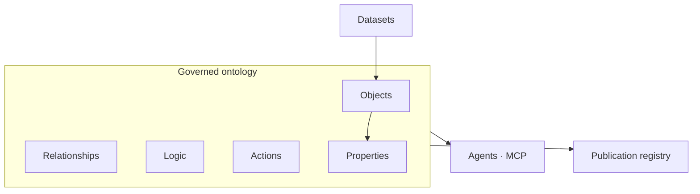
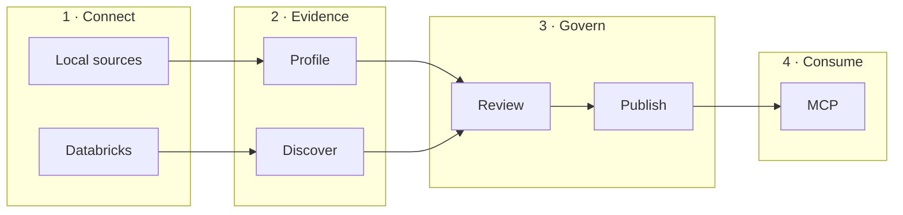

<div align="center">
  <picture>
    <source media="(prefers-color-scheme: dark)" srcset="docs/assets/logo-white.png" />
    <source media="(prefers-color-scheme: light)" srcset="docs/assets/logo-black.png" />
    
  </picture>
  <p>
    <strong>The governed ontology for your organization</strong><br />
    Objects, relationships, logic, and actions — evidence-backed, reviewed, and versioned
  </p>
  <p>
    
    
    
    
  </p>
</div>

Organizations hold data in warehouses, exports, and documents. They rarely hold a single, auditable definition of what that data **means**. Anchor produces that definition: a **governed ontology** above your sources, without replacing the systems that store the rows.

Stewards review what inference cannot confirm. Agents consume what the organization has published.

---

## Ontology

| Primitive        | Meaning                                                      |
| ---------------- | ------------------------------------------------------------ |
| **Object**       | A business concept tied to a dataset                         |
| **Property**     | An attribute tied to a column                                |
| **Relationship** | A link between objects, with cardinality                     |
| **Logic**        | A business definition or constraint                          |
| **Action**       | An operation contract on an object (specified; not executed) |

Each element records **confidence**, **provenance**, **review status**, and a **lifecycle** from discovery to publication.



Full specification: **[Ontology](./docs/ONTOLOGY.md)**.

---

## Operating model

Anchor separates three responsibilities.

| Stage         | Question                            | Mechanism                                         |
| ------------- | ----------------------------------- | ------------------------------------------------- |
| **Evidence**  | What does the data show?            | Deterministic profiling and discovery             |
| **Proposal**  | What does it likely mean?           | Inference on statistics only — never row payloads |
| **Agreement** | What has the organization accepted? | Review, validation, and versioned publication     |



Default path: local files into a workspace snapshot, then proposal and review. Warehouse path: **Databricks** for inspect and discover, without copying the warehouse. See [Providers](./docs/PROVIDERS.md).

Inference, when used, sends column names, types, and distributions to the endpoint you configure. Source files and cell values stay on your infrastructure. See [Security and data residency](./docs/SECURITY-AND-RESIDENCY.md).

---

## Documentation

| Document                                                        | Audience                                 |
| --------------------------------------------------------------- | ---------------------------------------- |
| **[Ontology](./docs/ONTOLOGY.md)**                              | Structure, primitives, governance fields |
| [Documentation hub](./docs/README.md)                           | Index                                    |
| [Architecture](./docs/ARCHITECTURE.md)                          | System design                            |
| [Operations](./docs/OPERATIONS.md)                              | Workspace and CLI                        |
| [Governance](./docs/GOVERNANCE.md)                              | Review, publish, rollback, audit         |
| [Providers](./docs/PROVIDERS.md)                                | Local snapshot and Databricks            |
| [Security and data residency](./docs/SECURITY-AND-RESIDENCY.md) | Security review                          |

---

## Capabilities

| Capability  | Outcome                                                                                 |
| ----------- | --------------------------------------------------------------------------------------- |
| Workspace   | Local artifacts, snapshot, and a committable ontology                                   |
| Discovery   | Deterministic objects and relationships from schema evidence                            |
| Review      | Risk-ranked confirmation before anything is treated as agreed                           |
| Publication | Numbered versions, archive, and rollback                                                |
| Databricks  | Catalog inspect and discover against a SQL warehouse                                    |
| Agents      | MCP over the agreed ontology, with no model call on the query path                      |
| Hosted      | Same pipeline as a multi-tenant API ([worker service](./apps/worker-service/README.md)) |

---

## Quick start

**Requirements:** Node.js ≥ 22 · pnpm · [Vercel AI Gateway](https://vercel.com/ai-gateway) key for semantic proposal

```bash
git clone https://github.com/trybacked/anchor.git
cd anchor && pnpm install && pnpm build
cd apps/cli && pnpm link --global
```

```bash
mkdir -p sources
backed init
backed model
backed review
backed validate
backed publish
backed serve
```

Environment: copy [`.env.example`](./.env.example). Databricks variables are required only for `--databricks`. Procedures: [Operations](./docs/OPERATIONS.md).

---

## Command reference

| Command           | Phase   | Result                                                       |
| ----------------- | ------- | ------------------------------------------------------------ |
| `backed init`     | Setup   | Workspace configuration                                      |
| `backed model`    | Build   | Ingest, profile, and semantic proposal                       |
| `backed inspect`  | Connect | Dataset catalog (add `--databricks` for the warehouse)       |
| `backed discover` | Connect | Deterministic discovery report                               |
| `backed review`   | Govern  | Steward decisions applied to the ontology                    |
| `backed validate` | Govern  | Structural validation                                        |
| `backed publish`  | Govern  | Version recorded in the registry (`--status` lists versions) |
| `backed rollback` | Govern  | A prior published version restored                           |
| `backed diff`     | Change  | Drift between runs (`--ontology` for breaking vs additive)   |
| `backed serve`    | Consume | MCP server                                                   |
| `backed gateway`  | Config  | Inference endpoint key                                       |
| `backed login`    | Config  | Optional telemetry authentication                            |

---

## Agent interface

`backed serve` answers from the agreed ontology. Responses are structured and schema-validated. There is no language model on this path.

| Operation        | Returns                                                     |
| ---------------- | ----------------------------------------------------------- |
| `list_entities`  | Object catalog                                              |
| `get_entity`     | Properties and provenance                                   |
| `list_relations` | Relationships and cardinality                               |
| `search_model`   | Search across objects, properties, relationships, and logic |
| `get_definition` | A confirmed logic statement, or a structured miss           |

Tool names follow the current MCP contract. They resolve the ontology primitives in [Ontology](./docs/ONTOLOGY.md).

---

## Data residency

| Data                              | Leaves your infrastructure                                     |
| --------------------------------- | -------------------------------------------------------------- |
| Source files, rows, document text | No                                                             |
| Agreed ontology                   | No, unless you publish it yourself (Git or hosted API)         |
| Column statistics                 | Only to your configured inference endpoint, during proposal    |
| Warehouse metadata                | Only to your Databricks workspace, when you use `--databricks` |

---

## Hosted deployment

The worker service runs the same stages for tenants that submit a corpus over HTTP. Uploaded bytes are removed after each run; derived artifacts and a deletion ledger remain. SDK: [`@trybacked/anchor`](./packages/anchor). Deployment: [worker service](./apps/worker-service/README.md).

---

## Development

```bash
pnpm install && pnpm build
pnpm generate:schema
pnpm test
```

| Package                                                   | Responsibility                         |
| --------------------------------------------------------- | -------------------------------------- |
| `@trybacked/core`                                         | Ontology schema, governance, workspace |
| `@backed/discovery`                                       | Deterministic discovery                |
| `@backed/provider-duckdb` · `@backed/provider-databricks` | Dataset providers                      |
| `@backed/runner`                                          | Pipeline                               |
| `@backed/cli`                                             | Command line                           |

Published packages use `@trybacked/*`. Workspace packages use `@backed/*`.

Maintainer roadmap: [Architecture evolution](./docs/ONTOLOGY-ENGINE-MIGRATION.md).
