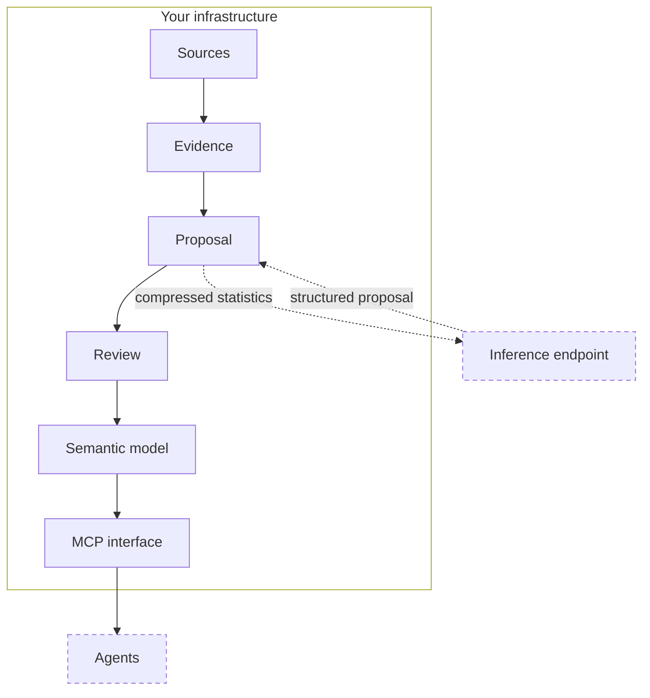

<div align="center">
  <picture>
    <source media="(prefers-color-scheme: dark)" srcset="docs/assets/logo-white.png" />
    <source media="(prefers-color-scheme: light)" srcset="docs/assets/logo-black.png" />
    
  </picture>
  <p><strong>The institutional memory of every organization</strong></p>
  <p>Open protocol for organizational semantic models</p>
  <p>
    
    
    
    
  </p>
</div>

Every organization runs on data spread across systems that were never built to share a vocabulary. ERP, exports, spreadsheets, and documents each tell a partial story; without a shared layer of meaning, humans argue over definitions and agents invent new ones every session.

Anchor does not move data or replace systems. It builds the **ontology layer** above them — the same primitive enterprise platforms treat as foundational: map sources to **entities**, wire **relations**, capture **business definitions**, and govern what is true with provenance and confidence. That layer _is_ institutional memory when it is written down, versioned, and shared.

The output is `model.yaml`: a committable semantic model. Humans confirm what the machine is unsure about through risk-ranked review; agents query what has been confirmed through MCP.

|              |                                |
| ------------ | ------------------------------ |
| **Anchor**   | Protocol                       |
| **Backed**   | Company, commercial service    |
| `model.yaml` | Protocol artifact (the output) |
| `backed`     | CLI command                    |

**Protocol artifacts:** `[schema/anchor-schema-v1.json](./schema/anchor-schema-v1.json)` (JSON Schema) · `[docs/MODEL-FORMAT-v1.md](./docs/MODEL-FORMAT-v1.md)` (format spec)

---

## Why

Organizations have data everywhere and meaning nowhere. Three systems disagree on customer count because _customer_ was never defined — not in the database, but in the ontology that should sit above it. Anchor brings that layer within reach for ordinary organizations: local-first, evidence-backed, and small enough to stay true.

---

## How it works

Anchor keeps three questions separate: **what the data shows**, **what it means**, and **what the organization has agreed is true**. Evidence is computed locally and reproducibly. Meaning is inferred, but only from compressed statistics. Truth is decided by people, and recorded with the reasoning behind it.

### Architecture



Everything on the solid path runs where your data already lives. The dotted path is the only network call in the pipeline, and it carries column names, types, distributions, and patterns — never rows, cell values, or document text.

### Stages

| Stage        | Function                                                   | Inference            |
| ------------ | ---------------------------------------------------------- | -------------------- |
| **Ingest**   | Normalize sources into a queryable local snapshot          | None                 |
| **Classify** | Assign document types from workspace naming rules          | Ambiguous files only |
| **Extract**  | Derive structured mentions and facts from documents        | None                 |
| **Index**    | Embed document chunks for semantic search                  | Embeddings only      |
| **Profile**  | Compute statistical evidence per table and column          | None                 |
| **Propose**  | Derive entities, properties, relations, and business rules | Structured tables    |
| **Review**   | Arbitrate uncertain inferences                             | None                 |
| **Serve**    | Answer ontology queries                                    | None                 |

Six of the eight stages involve no inference at all. Ingest resolves encodings, delimiters, regional number formats, and nested archives without a model call. Profiling derives null rates, distinct counts, value patterns, candidate keys, and the cross-table value overlap that surfaces foreign-key candidates.

### Design invariants

These hold on every run and are enforced in code, not by convention.

| Invariant                 | Guarantee                                                                                                  |
| ------------------------- | ---------------------------------------------------------------------------------------------------------- |
| **Read-only sources**     | Anchor never writes to, moves, or mutates the files you point it at                                        |
| **Data locality**         | Inference sees compressed statistics only — never rows, cell values, or document text                      |
| **Full traceability**     | Every entity, property, relation, and rule records the source table, column, and justifying evidence       |
| **Validated state**       | Pipeline state is read and written through versioned schemas; malformed state fails closed                 |
| **Inert caching**         | Responses are cached under a content hash of model, prompt, and schema — caching changes cost, not results |
| **No silent uncertainty** | Anything below threshold becomes a review question or a recorded doubt, never an unannounced fact          |

### Governance

Confidence decides whether a person is asked. The answer decides what is written.

| Confidence               | Behaviour                       | Outcome                           |
| ------------------------ | ------------------------------- | --------------------------------- |
| At or above `0.95`       | Accepted without a question     | Confirmed                         |
| Between `0.7` and `0.95` | Raised for review               | Confirmed, renamed, or removed    |
| Below `0.7`              | Recorded as a doubt or question | Proposed, or removed on rejection |

Reviewers answer Yes, No, or Rename. A rejection removes the element outright — it never reaches the model. Both thresholds are configurable per workspace.

### Change management

Every source file is fingerprinted by content hash. Re-running the pipeline reprocesses only what changed; unchanged files cost nothing. Consecutive runs can be compared to show what moved in the ontology — entities added, relations dropped, confidence shifted — so model drift stays reviewable instead of invisible.

### Deployment

**Local-first.** One workspace per organization or project. The model, the data snapshot, and every run artifact stay on the machine. Serving the model over MCP requires no account and no network.

**Hosted and ephemeral.** The same pipeline runs as a multi-tenant service where uploaded bytes are garbage-collected after each run, only derived artifacts persist, and every deletion is written to an append-only audit log. See [Hosted deployment](#hosted-deployment).

---

Commands, configuration, and artifacts: [Operational workflow](#operational-workflow) · [The model](#the-model).

---

## Install

**Requirements:** Node.js ≥ 22 · pnpm · [Vercel AI Gateway](https://vercel.com/ai-gateway) API key

```bash
git clone https://github.com/trybacked/anchor.git
cd anchor && pnpm install && pnpm build
cd apps/cli && pnpm link --global
```

Create `.env` in your **workspace root** (the folder containing `.backed/`, or any parent of your cwd — Anchor walks up to find it):

```bash
AI_GATEWAY_API_KEY=...                          # required
REVIEW_CONFIDENCE_THRESHOLD=0.95                # optional
# SEMANTIC_MODEL=zai/glm-5.3-flash
# SEMANTIC_EMBEDDING_MODEL=openai/text-embedding-3-small
```

---

## Operational workflow

The local path: one workspace folder per organization or project, driven by the `backed` CLI. Configuration lives in that folder, and inference calls go only to the endpoint you set in `.env`. To run the same pipeline as a service instead, see [Hosted deployment](#hosted-deployment).

### 1. Initialize (`backed init`)

Run once per folder (or again to change document rules):

```bash
mkdir -p sources
backed init
```

**Prompts:** optional document filename rules (explained in the wizard) → sources folder.

**Output:** `.backed/config.yaml`. Edit before `backed model` to fine-tune rules.

Each PDF filename becomes a **slug** (lowercase, punctuation → underscores). Rules check whether the slug **contains** your keyword.

```yaml
sourcesDir: ./sources
documentTypeHints:
  # keyword in filename slug → type id + display name (no LLM when confidence ≥ 0.85)
  - match: invoice # matches invoice_acme_2026.pdf, acme_invoice_q1.pdf, …
    documentType: invoice # id in model.yaml / MCP
    documentTypeLabel: Invoice # label in review
    confidence: 0.95
  - match: inv # second keyword, same type — add one rule per keyword
    documentType: invoice
    documentTypeLabel: Invoice
    confidence: 0.95
  - match: notice
    documentType: notice
    documentTypeLabel: Notice
    confidence: 0.9
```

Example: `public_notice_board.pdf` → slug `public_notice_board` → matches `notice`. Confidence ≥ 0.85 → deterministic (no LLM). No match → one LLM call per file. **No built-in rules at runtime** - only `config.yaml`. Empty list = LLM for every document.

### 2. Build (`backed model`)

```bash
backed model              # sources from config
backed model ./exports    # override sources (updates config)
backed model --full       # re-infer everything
```

| Stage            | When         | LLM?                 | Output                                                             |
| ---------------- | ------------ | -------------------- | ------------------------------------------------------------------ |
| Ingest           | Always       | No                   | `.backed/data.duckdb`                                              |
| Documents        | PDF/TXT/DOCX | Ambiguous files only | `documents.json`                                                   |
| Mentions + facts | Documents    | No                   | `document_mentions`, `document_facts`, `entity_profiles` in DuckDB |
| Chunk + embed    | Documents    | Embeddings only      | vectors in DuckDB                                                  |
| Profile          | Always       | No                   | `profile.json`                                                     |
| Proposal         | Always       | Structured tables    | `proposal.json`                                                    |

LLM responses are cached on disk in `.backed/cache/llm/`, keyed by model + prompt + schema. The cache only reduces cost and latency — it never changes validated outputs. Delete the folder or run `backed model --full` to re-infer from scratch.

Fact extraction is deterministic and runs during `backed model`. Upgrading `@backed/semantic` does not mutate an existing snapshot — **re-run** `backed model` on workspaces that already have document corpora when fact parsing improves.

**PDF-only folders:** `doc_`* tables get deterministic ontology (no column-classification LLM). **Mixed folders:** CSV gets LLM ontology; documents stay deterministic.

Requires `AI_GATEWAY_API_KEY` — see [Install](#install).

### 3. Review (`backed review`)

Confirms or rejects proposals → writes `model.yaml`.

### 4. Serve (`backed serve`)

Authenticated MCP stdio — five deterministic operations on `model.yaml` (see [MCP surface](#mcp-surface)).

### 5. Data changes

```bash
backed model && backed diff
```

### Cheat sheet

```bash
backed init && backed model && backed review && backed serve
```

Agent pattern: `list_entities` → `get_entity` → `search_model` / `get_definition`.

---

## Hosted deployment

The service path: the same pipeline exposed as a multi-tenant HTTP API, for organizations that submit a corpus rather than run a CLI. Partners upload files, the service infers the model, and the uploaded bytes are destroyed when the run completes.

### How it differs from the local path

| Aspect    | Local workflow           | Hosted deployment                           |
| --------- | ------------------------ | ------------------------------------------- |
| Interface | `backed` CLI             | HTTP API and TypeScript SDK                 |
| Tenancy   | One workspace per folder | Many isolated tenants per instance          |
| Raw files | Stay on your machine     | Deleted after every run                     |
| Review    | Interactive prompts      | API-driven                                  |
| Audit     | Run artifacts on disk    | Append-only deletion log and content ledger |

### Ephemeral by construction

Each tenant workspace separates processing from persistence:

```
tenants/<tenantId>/
├── work/      ← uploaded bytes and pipeline scratch, garbage-collected every run
└── persist/   ← derived artifacts only
```

Documents and the raw corpus **never** persist. What survives a run is the semantic model, domain vocabulary, document catalog metadata, the profile snapshot, content hashes, and review artifacts. Every deletion is written to an append-only log that can be queried for audit, and re-submitting unchanged files costs nothing because content hashes skip them.

```bash
export WORKER_SERVICE_AUTH_TOKEN=dev-token
pnpm --filter @backed/worker-service start
```

Configuration reference: `[apps/worker-service](./apps/worker-service)`.

### Docker / Railway

Build from the repository root (slim image, CSV/JSON/XLSX):

```bash
docker build -f apps/worker-service/Dockerfile -t backed-worker-service .
docker run --rm -p 8790:8790 \
  -e WORKER_SERVICE_AUTH_TOKEN=dev-token \
  -e AI_GATEWAY_API_KEY="$AI_GATEWAY_API_KEY" \
  -v backed-worker-data:/data \
  backed-worker-service
```

For PDF and scanned-document support, use the full image variant:

```bash
docker build -f apps/worker-service/Dockerfile --build-arg IMAGE_VARIANT=full -t backed-worker-service:full .
```

Railway: use `apps/worker-service/railway.toml`, Dockerfile path `apps/worker-service/Dockerfile`, and **mount a persistent volume at** `/data`. Copy `apps/worker-service/.env.example` for required variables.

Post-deploy smoke test:

```bash
export WORKER_SERVICE_URL=https://your-service.example
export WORKER_SERVICE_AUTH_TOKEN=...
apps/worker-service/scripts/smoke.sh
```

Structured logs (JSON lines on stdout): `run.started`, `gc.completed`, `run.completed`, `run.failed` with `tenantId`, `runId`, `partnerId`, `durationMs`, `filesDeleted`, `skipped`.

`GET /health` returns `{ ok, service, version, dataRootWritable }` — `ok` is false when the volume is missing or read-only (HTTP 503).

**Alerting hints:** failed run rate spikes; `gc.completed` with `bytesDeleted: 0` on runs that uploaded files; `dataRootWritable: false`; disk usage on the `/data` volume.

### TypeScript SDK

Official SDK: `[packages/anchor](./packages/anchor)` (`@trybacked/anchor`).

Types are generated from `apps/worker-service/openapi.yaml` via [openapi-typescript](https://github.com/openapi-ts/openapi-typescript); requests use [openapi-fetch](https://github.com/openapi-ts/openapi-typescript/tree/main/packages/openapi-fetch).

```typescript
import { createAnchorClient } from "@trybacked/anchor";

const anchor = createAnchorClient({
  baseUrl: "https://anchor.backed.app",
  token: process.env.ANCHOR_API_TOKEN!,
});

const { runId } = await anchor.submitRun("demo", [{ filename: "export.csv", content: csv }]);
await anchor.waitForRun("demo", runId);
const { model } = await anchor.getModel("demo");
```

API surface:

- `GET /openapi.yaml` — OpenAPI 3.1 spec (no auth)
- `POST /v1/tenants/:tenantId/runs` — multipart upload → `{ runId }`
- `GET /v1/tenants/:tenantId/runs/:runId` — `{ status, stats?, deletionEntry?, failureMessage? }` (`failureMessage` when `status` is `failed`)
- `GET /v1/tenants/:tenantId/model` — current `model.yaml` (+ `ETag`)
- `GET|POST /v1/tenants/:tenantId/review` — remote review flow
- `GET /v1/tenants/:tenantId/audit/deletions?since=&until=&offset=&limit=` — paginated deletion log (no document content)
- `GET /v1/tenants/:tenantId/audit/ledger` — content-hash list from `ledger.json`
- `run.completed` webhook — signed POST on terminal runs (partner config via `WORKER_SERVICE_PARTNERS_JSON`)

---

## The model

`model.yaml` contains no data. It contains the **model of the data** — portable, committable, schema-validated (`SemanticModelSchema` in `@trybacked/core`).

### Primitives

| Primitive | YAML key                | Anchored to                             |
| --------- | ----------------------- | --------------------------------------- |
| Entity    | `entities`              | Source table                            |
| Property  | `entities[].properties` | Source column                           |
| Relation  | `relations`             | Column pair (`fromColumn` → `toColumn`) |
| Rule      | `rules`                 | Entity (+ optional column)              |

Property semantic types: `text` · `number` · `amount` · `date` · `boolean` · `identifier` · `email` · `vat_number` · `fiscal_code` · `category`

Property roles: `primary_key` · `foreign_key` · `attribute`

Relation cardinality: `one_to_one` · `one_to_many` · `many_to_many`

Every element carries `confidence` (0–1), `provenance` (table, optional column, evidence sentence), and `status`:

| Status      | Meaning                                                                                       |
| ----------- | --------------------------------------------------------------------------------------------- |
| `proposed`  | Inferred, not explicitly reviewed (below threshold or unanswered question)                    |
| `confirmed` | Accepted (Yes) or auto-confirmed when confidence ≥ review threshold and no question was asked |
| `renamed`   | Accepted with corrected label (Rename)                                                        |

Rejected elements (No) are omitted. Elements at or above `REVIEW_CONFIDENCE_THRESHOLD` that were not asked in review are written as `confirmed`. Below confidence threshold 0.7, elements become doubts or review questions — never silent facts.

### Example

```yaml
metadata:
  formatVersion: "1"
  runId: 20260903T191233-4f2a
  generatedAt: 2026-09-03T19:12:33.000Z

entities:
  - id: customer
    name: Customer
    sourceTable: customers
    status: confirmed
    confidence: 0.95
    provenance:
      table: customers
      evidence: "8 rows, candidate key id, identity columns"
    properties:
      - name: VAT Number
        columnName: vat_number
        semanticType: vat_number
        role: attribute
        confidence: 0.98
        provenance:
          table: customers
          column: vat_number
          evidence: "VAT pattern on 100% of sampled values"

relations:
  - id: invoice-customer
    name: Invoice issued to Customer
    fromEntity: invoice
    toEntity: customer
    fromColumn: customer_id
    toColumn: id
    cardinality: one_to_many
    status: confirmed
    confidence: 0.9

rules:
  - id: invoice-overdue
    name: Overdue invoice
    definition: An invoice is overdue when status equals "overdue".
    appliesTo: invoice
    column: status
    status: proposed
    confidence: 0.7
```

### Run artifacts

Each pipeline run stores intermediate artifacts under `.backed/runs/<run-id>/`:

| File             | Contents                                                                                                                                         |
| ---------------- | ------------------------------------------------------------------------------------------------------------------------------------------------ |
| `profile.json`   | Statistical evidence per table/column                                                                                                            |
| `documents.json` | Document catalog (types, protocol, dates) when line-documents were ingested; canonical `documentType` per `sourceTable` is preserved across runs |
| `proposal.json`  | LLM proposal + doubts + review questions                                                                                                         |
| `review.json`    | Human answers                                                                                                                                    |
| `model.yaml`     | Final model (workspace root)                                                                                                                     |
| `diff.json`      | Changes vs previous run                                                                                                                          |

All files are schema-validated on read and write.

### Workspace layout

```
<workspace>/
├── sources/                 # Your data — read-only for Anchor
├── model.yaml               # Anchor model (after review)
├── .env                     # API keys (not committed)
└── .backed/
    ├── config.yaml          # sourcesDir + documentTypeHints (from backed init)
    ├── data.duckdb          # DuckDB snapshot (written by backed model)
    └── runs/<run-id>/
        ├── documents.json   # document catalog (when PDFs/TXT present)
        ├── profile.json
        ├── proposal.json
        ├── review.json
        └── diff.json
```

---

## MCP surface

`backed serve` exposes the semantic model over MCP stdio. Every response is structured JSON, Zod-validated, with **no LLM** in the path.

| Operation              | Input              | Returns                                                                                                                    |
| ---------------------- | ------------------ | -------------------------------------------------------------------------------------------------------------------------- |
| `list_entities()`      | —                  | id, name, description, status                                                                                              |
| `get_entity(id)`       | entity id          | properties (semanticType, role, provenance), entity provenance                                                             |
| `list_relations(id?)`  | optional entity id | relations with cardinality and status                                                                                      |
| `search_model(query)`  | text               | semantic document-chunk search when DuckDB vectors exist, plus substring matches on entities, properties, relations, rules |
| `get_definition(term)` | term               | confirmed rule (substring match), or structured not-found                                                                  |

Data is read from local `model.yaml` only. DuckDB snapshots are used by `backed model`, not by `serve`.

---

## Data residency

A security review should be answerable from this section alone.

### What leaves your infrastructure

| Data                                         | Leaves the machine                                   |
| -------------------------------------------- | ---------------------------------------------------- |
| Source files                                 | Never                                                |
| Rows, cell values, document text             | Never                                                |
| The semantic model                           | Never                                                |
| Review decisions                             | Never                                                |
| Column names, types, distributions, patterns | During inference only, to the endpoint you configure |
| Names of operations agents call              | Only when telemetry is explicitly enabled            |

Inference is the only stage in the pipeline that opens a network connection, and it reaches the endpoint named in your own configuration. Anchor operates no service of its own in this path.

### Serving modes

Serving the model to agents is a local operation. It has two modes, and the default requires nothing.

| Mode                  | Requires                          | Network at runtime | Emits           |
| --------------------- | --------------------------------- | ------------------ | --------------- |
| **Local** _(default)_ | Nothing                           | None               | Nothing         |
| **Telemetry**         | An account and an explicit opt-in | Outbound only      | Operation names |

In local mode there is no account, no network call, and no external dependency. The model is read from disk and served over standard input and output.

### Telemetry

Telemetry is opt-in and requires two independent actions: signing in once, and setting `BACKED_TELEMETRY=1`. If either is missing, serving silently stays local — a stale or absent session downgrades rather than failing.

When enabled, each agent tool call emits a single field: the name of the operation invoked, such as `list_entities`. No arguments, no results, no model content, no identifiers from your data. Emission is fire-and-forget on a background task; if the network is unavailable or the endpoint rejects the request, the error is discarded and the agent's call proceeds unaffected.

Credentials are verified once at startup, not on every call.

---

## CLI

| Command                 | Purpose                                                                                                                               |
| ----------------------- | ------------------------------------------------------------------------------------------------------------------------------------- |
| `backed init [folder]`  | Interactive workspace setup: `sourcesDir` + `documentTypeHints` in `.backed/config.yaml`                                              |
| `backed model [folder]` | Full pipeline: ingest → documents (if any) → profile → proposal. Incremental when `model.yaml` exists; `--full` re-infers everything. |
| `backed review`         | Interactive review → writes `model.yaml`                                                                                              |
| `backed diff`           | Compare last two runs                                                                                                                 |
| `backed login`          | Sign in to Backed (optional — required only for telemetry)                                                                            |
| `backed serve`          | Local MCP stdio server (5 operations on `model.yaml`)                                                                                 |

See [Operational workflow](#operational-workflow) for the step-by-step guide.

---

## Development

```bash
pnpm install && pnpm build
pnpm generate:schema   # refresh schema/anchor-schema-v1.json after Zod changes
pnpm test
pnpm cli --help
```

### Packages

Dependency order: `@trybacked/core` → `ingest` → `profile` → `semantic` → `diff` / `mcp` → `@backed/runner` → `apps/cli` / `apps/worker-service`.

Packages published to npm use the `@trybacked/*` scope; internal workspace packages use `@backed/*`.

| Package                                        | Scope     | Role                                             |
| ---------------------------------------------- | --------- | ------------------------------------------------ |
| `[packages/core](./packages/core)`             | published | Zod schemas, `model.yaml`, workspace layout      |
| `[packages/anchor](./packages/anchor)`         | published | TypeScript SDK for the hosted worker API         |
| `[packages/ingest](./packages/ingest)`         | internal  | Source scanning, parsing, DuckDB materialization |
| `[packages/profile](./packages/profile)`       | internal  | Column profiling and relation candidates         |
| `[packages/semantic](./packages/semantic)`     | internal  | LLM bursts: classification, ontology, extraction |
| `[packages/diff](./packages/diff)`             | internal  | Run-to-run model and profile diffs               |
| `[packages/mcp](./packages/mcp)`               | internal  | Local MCP server over `model.yaml`               |
| `[packages/runner](./packages/runner)`         | internal  | Pipeline orchestration and incremental runs      |
| `[apps/cli](./apps/cli)`                       | internal  | `backed` command-line interface                  |
| `[apps/worker-service](./apps/worker-service)` | internal  | Multi-tenant hosted pipeline API                 |
| `[apps/auth-api](./apps/auth-api)`             | internal  | Device-flow auth server for `backed login`       |

### CI

GitHub Actions runs lint, Prettier check, build, typecheck, a schema drift check, and coverage-gated tests. The suite includes the **Gerace golden** `model.yaml` fixture and a **three-run incremental session** (`packages/runner/tests/golden/gerace-incremental.test.ts`: cold → warm → +1 file on `fixtures/gerace-albo`, with deterministic LLM mocks).

Releases are driven by [Changesets](https://github.com/changesets/changesets): run `pnpm changeset` alongside any change to a published package.
