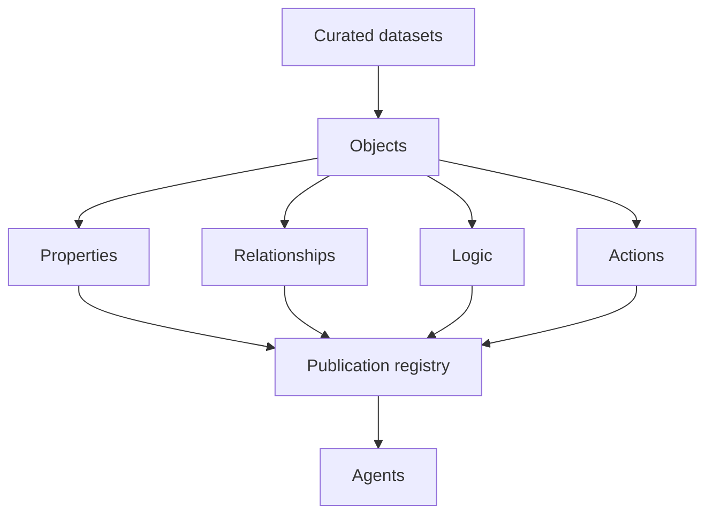
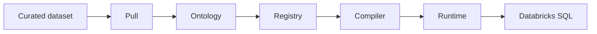

<div align="center">
  <picture>
    <source media="(prefers-color-scheme: dark)" srcset="docs/assets/logo-white.png" />
    <source media="(prefers-color-scheme: light)" srcset="docs/assets/logo-black.png" />
    
  </picture>
  <p>
    <strong>The governed ontology for your organization</strong><br />
    Objects, relationships, logic, and actions — evidence-backed and versioned
  </p>
  <p>
    
    
    
    
  </p>
</div>

Organizations hold curated datasets in their warehouse. They rarely hold a single, auditable definition of what that data **means**. Anchor produces that definition: a **governed ontology** above your datasets, without replacing the systems that store the rows.

**Anchor does not turn raw data into datasets. Anchor turns datasets into meaning.** Ingestion, parsing, and storage belong to your data platform; Anchor starts where a structured, queryable dataset already exists.

Discovery is deterministic; agents consume the synced registry via deploy.

---

## Quick start

**Requirements:** Node.js ≥ 22 · pnpm · Databricks tables in a SQL warehouse (for `pull`). Copy [`.env.example`](./.env.example) and set `BACKED_DATABRICKS_HOST`, `BACKED_DATABRICKS_TOKEN`, `BACKED_DATABRICKS_WAREHOUSE_ID`.

```bash
npm install -g @trybacked/cli
```

From source (contributors):

```bash
git clone https://github.com/trybacked/anchor.git
cd anchor && pnpm install && pnpm build
pnpm link --global --dir apps/cli
```

```bash
backed version
backed anchor init
backed anchor pull
backed anchor sync
backed anchor deploy
```

---

## Ontology

| Primitive        | Meaning                                                      |
| ---------------- | ------------------------------------------------------------ |
| **Object**       | A business concept tied to a dataset                         |
| **Property**     | An attribute tied to a column                                |
| **Relationship** | A link between objects, with cardinality                     |
| **Logic**        | A business definition or constraint                          |
| **Action**       | An operation contract on an object (specified; not executed) |

Each element records **confidence**, **provenance**, **review status**, and a **lifecycle** from discovery to publication.



Datasets become objects. Properties, relationships, logic, and actions describe those objects. The publication registry stores that version. Agents read the registry and query objects through it.

---

## Operating model

The flow before Anchor stays in your platform: **files / databases / APIs → ingestion → warehouse pipeline → curated dataset**. Anchor begins at the curated dataset.

| Step        | Question                    | What happens                                                          |
| ----------- | --------------------------- | --------------------------------------------------------------------- |
| **Connect** | Where is the data?          | A Databricks SQL warehouse, queried in place                          |
| **Pull**    | What does the schema show?  | Warehouse profile → `model.yaml` (objects, properties, relationships) |
| **Sync**    | What is active for queries? | `sync` snapshots `model.yaml` into the local registry                 |
| **Agents**  | What can an agent rely on?  | `deploy` — MCP tools and object queries against the synced version    |



Discovery is deterministic: schema and statistics only, no language model. Rows never leave your warehouse; object queries run on it directly.

---

## Capabilities

| Capability | Outcome                                                            |
| ---------- | ------------------------------------------------------------------ |
| Workspace  | Local artifacts and a committable ontology                         |
| Pull       | Deterministic objects and relationships from warehouse schema      |
| Registry   | Versioned snapshots under `.backed/`                               |
| Query      | Compiled, parameterized SQL over published objects                 |
| Agents     | MCP over the agreed ontology, with no model call on the query path |

---

## Command reference

Top level: `backed version` · `backed anchor …` (other Backed services will get their own namespace later).

| Command                | Phase   | Result                                                    |
| ---------------------- | ------- | --------------------------------------------------------- |
| `backed anchor init`   | Setup   | Workspace configuration                                   |
| `backed anchor pull`   | Connect | Warehouse schema → `model.yaml`                           |
| `backed anchor sync`   | Govern  | Versioned snapshot in `.backed/` (see below)              |
| `backed anchor deploy` | Consume | MCP on stdio for agents (local process, not cloud deploy) |

Legacy: `backed init`, `publish`, `serve`, etc. still run with a hint to use `backed anchor …`.

### `pull` vs `sync` vs `deploy`

| Step       | Output                                             | Role                                                        |
| ---------- | -------------------------------------------------- | ----------------------------------------------------------- |
| **pull**   | `model.yaml` + run artifacts                       | Ontology from the warehouse (editable, committable)         |
| **sync**   | `.backed/publication.json`, `publications/vN.json` | Frozen version **`query_objects`** uses (validated on sync) |
| **deploy** | MCP on stdio                                       | Agents read the model; queries use the **synced** registry  |

Edit `model.yaml` without re-syncing and agents still query the previous registry version. List versions: `backed anchor sync --status`.

---

## Agent interface

`backed anchor deploy` answers from the agreed ontology. Responses are structured and schema-validated. There is no language model on this path.

| Operation        | Returns                                                     |
| ---------------- | ----------------------------------------------------------- |
| `list_entities`  | Object catalog                                              |
| `get_entity`     | Properties and provenance                                   |
| `list_relations` | Relationships and cardinality                               |
| `search_model`   | Search across objects, properties, relationships, and logic |
| `get_definition` | A confirmed logic statement, or a structured miss           |
| `query_objects`  | Rows of one synced object, with property filters and limit  |

`query_objects` requires a synced registry and Databricks env vars. SQL is compiled from registry mappings and runs on your warehouse.

Tool names follow the current MCP contract.

---

## Data residency

| Data               | Leaves your infrastructure                               |
| ------------------ | -------------------------------------------------------- |
| Rows               | No — object queries run inside your Databricks workspace |
| Agreed ontology    | No, unless you commit it yourself (for example via Git)  |
| Warehouse metadata | Only to your Databricks workspace                        |

---

## Development

```bash
pnpm install && pnpm build
pnpm generate:schema
pnpm test
```

```text
anchor/
├── apps/
│   └── cli/                    # backed command line
├── packages/
│   ├── core/                   # ontology schema, validation, DatasetProvider
│   ├── discovery/              # inspect/ evidence · propose/ deterministic proposal
│   ├── registry/               # publications, versioning, rollback
│   ├── compiler/               # object query → parameterized SQL
│   ├── runtime/                # executes compiled queries
│   ├── provider-databricks/    # Databricks SQL warehouse adapter
│   ├── diff/                   # run and ontology diffs
│   └── mcp/                    # agent tools + query_objects
├── schema/                     # JSON Schema for ontology serialization v1
└── docs/
```

| Package                          | Responsibility                                     |
| -------------------------------- | -------------------------------------------------- |
| `@trybacked/core`                | Ontology schema, validation, `DatasetProvider`     |
| `@trybacked/discovery`           | Deterministic inspection and proposal              |
| `@trybacked/registry`            | Publications, versioning, rollback                 |
| `@trybacked/compiler`            | Object queries → parameterized SQL                 |
| `@trybacked/runtime`             | Executes compiled queries via an injected executor |
| `@trybacked/provider-databricks` | Databricks SQL warehouse adapter                   |
| `@trybacked/mcp`                 | Agent tools over the published ontology            |
| `@trybacked/cli`                 | Command line (`npm install -g @trybacked/cli`)     |
| `@backed/diff`                   | Run and ontology diffs (workspace only)            |

Dependencies flow toward `core`, never the reverse.
