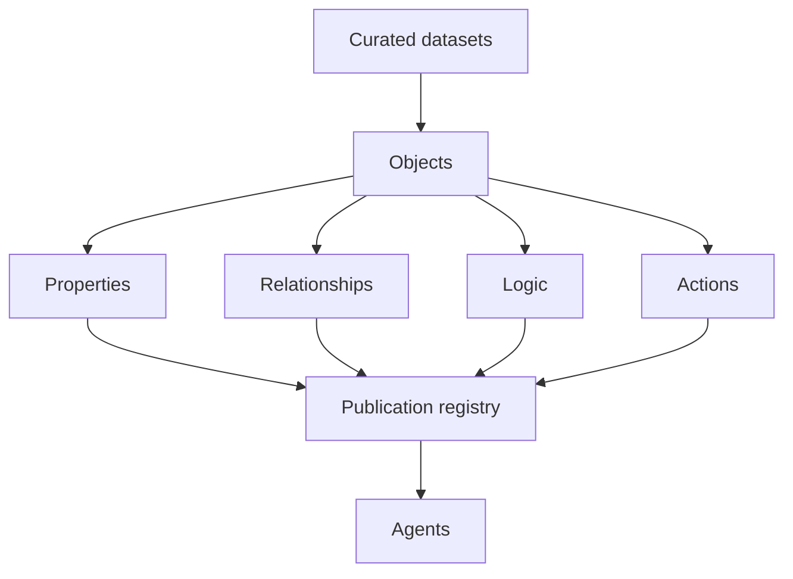
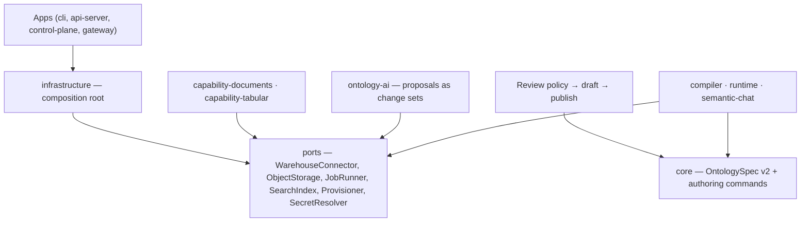

<div align="center">
  <picture>
    <source media="(prefers-color-scheme: dark)" srcset="docs/assets/logo-white.png" />
    <source media="(prefers-color-scheme: light)" srcset="docs/assets/logo-black.png" />
    
  </picture>
  <p>
    <strong>The governed ontology for your organization</strong><br />
    Objects, relationships, logic, and actions — evidence-backed and versioned
  </p>
  <p>
    
    
    
    
  </p>
</div>

Organizations accumulate curated data in many systems, yet rarely maintain one auditable definition of what that data **means**. Anchor provides that layer: a **governed ontology** that sits above your sources without replacing the systems of record.

The ontology model does not embed physical schema names, locale, or domain-specific vocabulary—those concerns stay in connector configuration (capabilities and bindings). The default installation discovers structure from **document collections on the filesystem**; additional engines can be added behind the same contracts. Discovery is deterministic; optional AI assistance turns inspection results into **reviewable change sets** before publication.

Anchor does not operate ingestion pipelines. It assumes you already expose structured, inspectable material (for example, organized folders of documents or tables in a warehouse) and focuses on meaning, versioning, and agent-safe publication. After `sync`, agents consume the published registry through `deploy` (MCP).

---

## Quick start

**Requirements:** Node.js ≥ 22 · pnpm. Copy [`.env.example`](./.env.example), set `BACKED_FILES_ROOT` (default `./sources`), add tenant documents, then run `backed anchor pull`.

```bash
npm install -g @trybacked/cli
```

From source (contributors):

```bash
git clone https://github.com/trybacked/anchor.git
cd anchor && pnpm install && pnpm build
pnpm link --global --dir apps/cli
```

```bash
backed version
backed anchor init
backed anchor pull
backed anchor sync
backed anchor deploy
```

---

## Ontology

| Primitive        | Meaning                                                      |
| ---------------- | ------------------------------------------------------------ |
| **Object**       | A business concept tied to a dataset                         |
| **Property**     | An attribute tied to a column                                |
| **Relationship** | A link between objects, with cardinality                     |
| **Logic**        | A business definition or constraint                          |
| **Action**       | An operation contract on an object (specified; not executed) |

Each element records **confidence**, **provenance**, **review status**, and a **lifecycle** from discovery to publication.


```mermaid
flowchart TB
  datasets["Curated datasets"] --> objects["Objects"]
  objects --> properties["Properties"]
  objects --> relationships["Relationships"]
  objects --> logic["Logic"]
  objects --> actions["Actions"]
  properties --> registry["Publication registry"]
  relationships --> registry
  logic --> registry
  actions --> registry
  registry --> agents["Agents"]
```

Datasets become objects. Properties, relationships, logic, and actions describe those objects. The publication registry stores that version. Agents read the registry and query objects through it.

---

## Operating model

The flow before Anchor stays in your platform: **files / databases / APIs → ingestion → warehouse pipeline → curated dataset**. Anchor begins at the curated dataset.

| Step        | Question                    | What happens                                                                    |
| ----------- | --------------------------- | ------------------------------------------------------------------------------- |
| **Connect** | Where is the data?          | Local file collections under `BACKED_FILES_ROOT` (one subfolder per collection) |
| **Pull**    | What does the schema show?  | File index profile → `model.yaml` (objects, properties, relationships)          |
| **Sync**    | What is active for queries? | `sync` snapshots `model.yaml` into the local registry                           |
| **Agents**  | What can an agent rely on?  | `deploy` — MCP tools and object queries against the synced version              |


```mermaid
flowchart LR
  dataset["Curated dataset"] --> pull["Pull"]
  pull --> ontology["Ontology"]
  ontology --> registry["Registry"]
  registry --> compiler["Compiler"]
  compiler --> runtime["Runtime"]
  runtime --> files["File source tree"]
```

Discovery is deterministic: file metadata and statistics only, no language model. Object SQL queries are not available on the files engine yet; agents still consume the synced ontology registry.

---

## Architecture

The engine is layered outside-in; dependencies always point toward `core`.


```mermaid
flowchart TB
  apps["Apps (cli, api-server, control-plane, gateway)"] --> infra["infrastructure — composition root"]
  infra --> ports["ports — WarehouseConnector, ObjectStorage, JobRunner, SearchIndex, Provisioner, SecretResolver"]
  capabilities["capability-documents · capability-tabular"] --> ports
  ai["ontology-ai — proposals as change sets"] --> ports
  review["Review policy → draft → publish"] --> spec["core — OntologySpec v2 + authoring commands"]
  runtime["compiler · runtime · semantic-chat"] --> ports
  runtime --> spec
```

Non-negotiable rules, enforced in CI by `pnpm guardrails`:

- **No domain literals in engine code** — table names, entity ids, and language keywords come from tenant configuration, source bindings, or the published ontology.
- **The kernel does no IO** — `core` and `ports` have no SDK dependencies.
- **Apps never import adapters** — they compose through `@trybacked/infrastructure`.
- **Capability, not assumptions** — document features exist only when a source declares the `documents` capability.
- **The AI proposes, policy decides** — every change is an authoring command with confidence and evidence; breaking changes always go to human review.

Tenant configuration (locale, connections, sources, AI review policy, model routing) lives in the control plane's tenant profile, seeded from `tenants.yaml`.

---

## Capabilities

| Capability   | Outcome                                                                |
| ------------ | ---------------------------------------------------------------------- |
| Workspace    | Local artifacts and a committable ontology                             |
| Pull         | Deterministic objects and relationships from warehouse schema          |
| Registry     | Versioned snapshots under `.backed/`                                   |
| Query        | Compiled, parameterized SQL over published objects                     |
| Agents       | MCP over the agreed ontology, with no model call on the query path     |
| AI authoring | Ontology and semantics proposed as change sets, gated by review policy |

---

## Command reference

Top level: `backed version` · `backed anchor …` (other Backed services will get their own namespace later).

| Command                | Phase   | Result                                                    |
| ---------------------- | ------- | --------------------------------------------------------- |
| `backed anchor init`   | Setup   | Workspace configuration                                   |
| `backed anchor pull`   | Connect | Warehouse schema → `model.yaml`                           |
| `backed anchor sync`   | Govern  | Versioned snapshot in `.backed/` (see below)              |
| `backed anchor deploy` | Consume | MCP on stdio for agents (local process, not cloud deploy) |

Legacy: `backed init`, `publish`, `serve`, etc. still run with a hint to use `backed anchor …`.

### `pull` vs `sync` vs `deploy`

| Step       | Output                                             | Role                                                        |
| ---------- | -------------------------------------------------- | ----------------------------------------------------------- |
| **pull**   | `model.yaml` + run artifacts                       | Ontology from the warehouse (editable, committable)         |
| **sync**   | `.backed/publication.json`, `publications/vN.json` | Frozen version **`query_objects`** uses (validated on sync) |
| **deploy** | MCP on stdio                                       | Agents read the model; queries use the **synced** registry  |

Edit `model.yaml` without re-syncing and agents still query the previous registry version. List versions: `backed anchor sync --status`.

---

## Agent interface

`backed anchor deploy` answers from the agreed ontology. Responses are structured and schema-validated. There is no language model on this path.

| Operation        | Returns                                                     |
| ---------------- | ----------------------------------------------------------- |
| `list_entities`  | Object catalog                                              |
| `get_entity`     | Properties and provenance                                   |
| `list_relations` | Relationships and cardinality                               |
| `search_model`   | Search across objects, properties, relationships, and logic |
| `get_definition` | A confirmed logic statement, or a structured miss           |
| `query_objects`  | Rows of one synced object, with property filters and limit  |

`query_objects` requires a synced registry and a warehouse executor. On the **files** engine, object SQL is not available yet; MCP still exposes catalog search and document preview when `BACKED_FILES_ROOT` is configured.

Tool names follow the current MCP contract.

---

## Data residency

| Data            | Leaves your infrastructure                              |
| --------------- | ------------------------------------------------------- |
| Rows            | No — stay on disk under your `BACKED_FILES_ROOT`        |
| Agreed ontology | No, unless you commit it yourself (for example via Git) |
| Source metadata | Read locally from the configured file tree              |

---

## Development

```bash
pnpm install && pnpm build
pnpm generate:schema
pnpm guardrails   # no-domain-literals scan + dependency-cruiser boundaries
pnpm test
```

```text
anchor/
├── apps/
│   ├── cli/                    # backed command line
│   ├── api-server/             # tenant runtime + authoring HTTP API
│   ├── control-plane/          # tenant profiles, jobs, AI proposal review
│   └── gateway/                # MCP gateway for tenants
├── packages/
│   ├── core/                   # OntologySpec v2, authoring commands, sources, validation
│   ├── ports/                  # engine interfaces (no IO, no SDKs)
│   ├── infrastructure/         # composition root (files engine + adapters)
│   ├── capability-documents/   # document archive features, binding-driven
│   ├── capability-tabular/     # structured source features
│   ├── discovery/              # inspect/ evidence · propose/ deterministic proposal
│   ├── ontology-extract/       # legacy document-warehouse extraction (superseded by ontology-ai)
│   ├── ontology-ai/            # AI proposals: pipeline, review policy, change sets
│   ├── ontology-authoring/     # applies authoring commands, model diffs
│   ├── registry/               # publications, versioning, rollback
│   ├── compiler/               # object query → parameterized SQL (per dialect)
│   ├── runtime/                # executes compiled queries
│   ├── semantic-chat/          # LLM chat over the ontology, capability-routed
│   ├── service/                # tenant runtime services (model, query, documents, ask)
│   └── mcp/                    # agent tools + query_objects
├── schema/                     # JSON Schema for ontology serialization
└── docs/
```

| Package                         | Responsibility                                                 |
| ------------------------------- | -------------------------------------------------------------- |
| `@trybacked/core`               | OntologySpec v2, authoring commands, sources, validation       |
| `@trybacked/ports`              | Engine interfaces: connector, storage, jobs, search            |
| `@trybacked/infrastructure`     | Files engine + `createDatasetProviderFromEnv` / ontology store |
| `@trybacked/capability-*`       | Binding-driven capability modules (documents, tabular)         |
| `@trybacked/ontology-ai`        | AI authoring pipeline and review policy                        |
| `@trybacked/ontology-authoring` | Apply/diff authoring commands                                  |
| `@trybacked/discovery`          | Deterministic inspection and proposal                          |
| `@trybacked/registry`           | Publications, versioning, rollback                             |
| `@trybacked/compiler`           | Object queries → parameterized SQL                             |
| `@trybacked/runtime`            | Executes compiled queries via an injected executor             |
| `@trybacked/semantic-chat`      | Domain-free chat over the published ontology                   |
| `@trybacked/mcp`                | Agent tools over the published ontology                        |
| `@trybacked/cli`                | Command line (`npm install -g @trybacked/cli`)                 |

Dependencies flow toward `core`, never the reverse.
